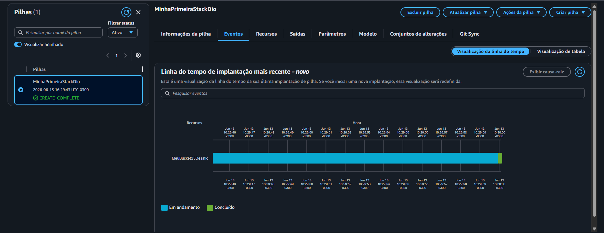

# Infraestrutura como Código (IaC) com AWS CloudFormation 🚀

Repositório criado para consolidar os aprendizados sobre o **AWS CloudFormation** no bootcamp da [DIO](https://www.dio.me/). Este projeto demonstra a implementação prática de uma Stack automatizada para provisionamento de recursos na AWS de forma padronizada e repetível.

---

## 🧠 O que é o AWS CloudFormation?

O **AWS CloudFormation** é um serviço que permite modelar e configurar seus recursos da AWS de forma declarativa utilizando arquivos de texto no formato JSON ou YAML. Esse conceito é conhecido como **Infraestrutura como Código (IaC)**, e resolve problemas comuns como configurações manuais erradas, além de permitir versionar a infraestrutura da mesma forma que versionamos códigos de software.

---

## 🏗️ O Template Desenvolvido

Neste laboratório, criei um template estruturado em **YAML** responsável por provisionar um recurso de armazenamento seguro:

- **Amazon S3 Bucket:** Configurado com um nome dinâmico baseado no ID da conta AWS (`!Sub`) e com o **versionamento ativado** de forma nativa para proteção contra exclusões acidentais.

### Monitoramento da Stack no Console

---

## 🛠️ Principais Seções de um Template CloudFormation

Durante as aulas, compreendi a estrutura fundamental de um arquivo de IaC:

- **AWSTemplateFormatVersion:** Define a versão das capacidades do template.
- **Description:** Um texto explicativo sobre o que a infraestrutura faz.
- **Resources (Obrigatório):** Declara os recursos da AWS que serão criados (Instâncias EC2, Bancos RDS, Buckets S3, etc.).
- **Parameters / Outputs (Opcionais):** Permitem flexibilizar a entrada de dados e exportar valores gerados para outras Stacks.

---

## 💡 Principais Insights e Aprendizados

1. **Automação e Consistência:** Criar recursos via console web consome tempo e abre margem para erros humanos. Com o CloudFormation, a infraestrutura é idêntica em qualquer região ou conta AWS onde o template for executado.
2. **Gerenciamento do Ciclo de Vida:** Quando uma Stack é atualizada ou excluída, o CloudFormation gerencia de forma inteligente a ordem correta de remoção ou alteração de cada recurso interligado.
3. **Idempotência:** O CloudFormation garante que o estado final da nuvem corresponderá exatamente ao que foi escrito no código, sem duplicar recursos se executado múltiplas vezes.

---

## 👨‍💻 Autor

Desenvolvido por **Nicolas Aires**.
